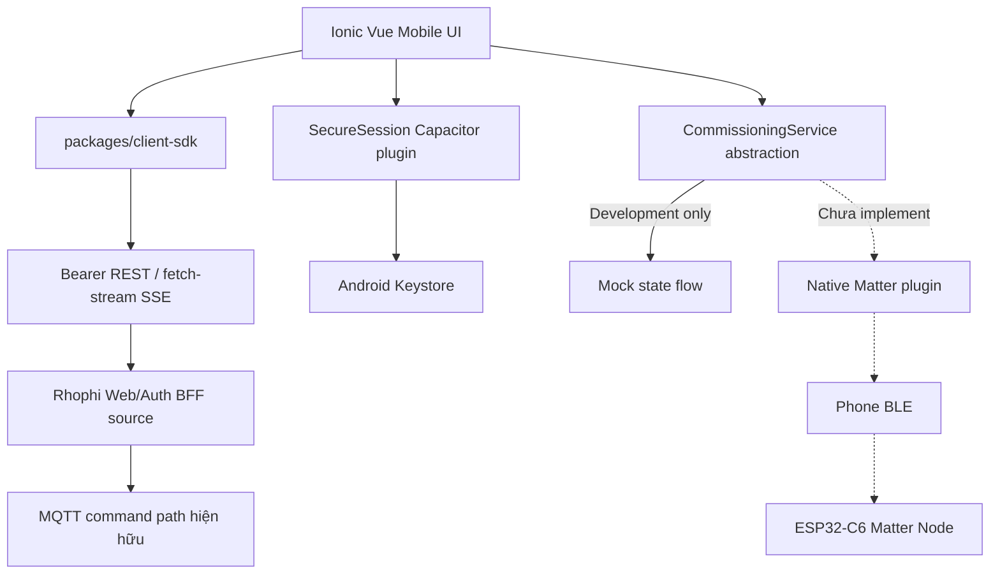

# Rhophi Mobile App — Implementation Context

## 0. Trạng thái as-built của repository

Cập nhật ngày 2026-08-17.

Repository `agile-mobileapp` hiện đã có Phase A source code và Add Device wizard development mock:

- npm workspaces root
- `apps/mobile`: Ionic Vue 3, Ionic 8, Capacitor 7, Pinia, Vue Router và Android project
- `packages/client-sdk`: typed REST client, authenticated SSE fetch-stream client, Pinia stores, device catalog adapter, redaction và commissioning state machine
- contracts mobile nội bộ tại `packages/client-sdk/src/contracts.ts`; không còn Git submodule hoặc workspace dependency tới dashboard
- dashboard controls: OnOff, Level, Window Covering, vendor Cooktop, connection badge và activity log
- Android secure session plugin dùng AES-256-GCM với non-exportable key trong Android Keystore; SharedPreferences chỉ giữ ciphertext và IV
- Add Device wizard có đầy đủ presentation states nhưng chỉ dùng development mock, không scan BLE và không chạy Matter

Source trong repository `agile-dashboard` riêng biệt, commit `0b4bb7c`, đã bổ sung:

- `POST /api/mobile/login`
- bearer authentication cho session, logout, command và SSE
- CORS allowlist cho Capacitor origin, mặc định `https://localhost`
- web/mobile sessions tồn tại đồng thời
- raw bearer token không được persist; session store chỉ lưu SHA-256 digest

Các thay đổi dashboard trên đã được commit trong repository dashboard riêng, nhưng chưa có bằng chứng release/deploy lên BBB. Vì vậy production tại `dashboard.rhophi.uk` chưa được coi là hỗ trợ mobile bearer auth cho đến khi commit đó được release và smoke-test.

Validation đã chạy:

- mobile tests: 13/13 pass
- dashboard tests: 17/17 pass, gồm integration test web cookie và mobile bearer session đồng thời
- mobile và dashboard typecheck pass
- mobile và dashboard production web build pass
- `cap sync android` pass
- Android SDK Platform 35/Build Tools 35.0.0 installed và `assembleDebug` pass
- debug APK signature v1/v2 verified
- production build từ chối `VITE_COMMISSIONING_MODE=mock`

Giới hạn validation hiện tại:

- debug APK đã build và verify; chưa cài/chạy smoke test trên Android phone
- Kotlin secure session plugin chưa được instrumentation-test trên Android device
- chưa flash hoặc HIL với ESP32-C6 application node
- chưa có BLE ICD, native Matter controller artifact, claim registry/API hoặc BBB commissioning RPC
- Gateway/controller deployed vẫn ở trạng thái mô tả tại mục 3

## 1. Mục tiêu

Xây dựng ứng dụng Mobile chính thức của Rhophi với hai chức năng:

1. Dashboard điều khiển thiết bị, tương tự WebUI hiện tại.
2. Add Device bằng Bluetooth của điện thoại, không yêu cầu người dùng quét QR trong luồng chính.

Hệ thống phải độc lập, không phụ thuộc Home Assistant, Google Home hoặc Apple Home.

Ứng dụng sử dụng Matter BLE commissioning chuẩn. Không tự thiết kế giao thức JSON để thay thế Matter PASE/commissioning.

## 2. Phạm vi phiên bản đầu

### Android first

- Ionic Vue + Capacitor UI: đã implement source và production web build
- REST/SSE client, Pinia logic và Ionic UI patterns tham khảo WebUI: đã implement
- Kotlin secure session plugin: đã implement source, chưa Gradle-build/HIL do thiếu Android SDK
- Kotlin BLE/Matter commissioning plugin: chưa implement; production UI báo `Commissioning unavailable`
- Add Device development mock: đã implement, chỉ bật khi `import.meta.env.DEV` và `VITE_COMMISSIONING_MODE=mock`
- iOS/Swift triển khai sau khi Android HIL đạt

### Device đầu tiên

ESP32-C6 Matter-over-Thread OnOff Plug-in Unit.

- endpoint 0: Matter root
- endpoint 1: OnOff server cluster
- GPIO LED hoặc relay điện áp thấp trong giai đoạn HIL
- local button
- WS2812 commissioning/status indicator

Không dùng tải điện lưới trong bring-up khi chưa có isolation, fuse, enclosure và safety review.

## 3. Trạng thái hệ thống Gateway hiện tại

Public Web/Auth:

```text
https://dashboard.rhophi.uk
→ Cloudflare Tunnel
→ matter-web-auth BFF 127.0.0.1:8082
→ Mosquitto 127.0.0.1:1883
→ matter-gateway
```

Thread/Matter:

```text
matter-controller 0.17.9
→ otbr-agent
→ ESP32-C6 RCP USB Spinel
→ OpenThread-0a76, channel 14, PAN 0x0a76
```

### Trạng thái deployed/as-built đã xác nhận

- OTBR leader, sống qua restart/reboot
- Matter.js Controller persistent fabric
- Unix RPC `health`, `listNodes`, `invoke`
- Gateway vẫn `CONTROLLER_MODE=mock`
- chưa có commissioned application node
- chưa có mobile commissioning API
- chưa có `removeNode`, `read`, subscription/event RPC
- chưa xác nhận mobile bearer auth đã deploy

### Trạng thái source trong repository dashboard riêng

- có mobile bearer login/session/logout/command/SSE và CORS allowlist
- web cookie session vẫn giữ origin + CSRF protection
- web/mobile sessions không còn tự evict lẫn nhau
- chưa có `/api/devices`; Mobile Phase A dùng static configured catalog giống WebUI hard-code hiện tại
- chưa có commissioning sessions API tại mục 12
- chưa có controller RPC hoặc Multi-Admin API tại mục 16

Không được suy luận trạng thái production từ source commit. Chỉ cập nhật phần deployed sau khi dashboard release tương ứng được kiểm tra trên BBB.

## 4. Kiến trúc Mobile



Mobile App không giữ MQTT credentials. Dashboard dùng HTTPS REST + authenticated SSE. Luồng BFF → Gateway cho command vẫn dùng MQTT hiện hữu; commissioning trong tương lai không được đi qua MQTT.

Ở production build hiện tại, `CommissioningService` dùng unavailable implementation. Mock không được fallback tự động và production build sẽ fail nếu cấu hình commissioning mode là `mock`.

## 5. Cấu trúc repository thực tế

```text
agile-mobileapp/
  apps/
    mobile/
      src/
        components/
        services/
        stores/
        views/
      android/
  packages/
    client-sdk/
      src/
        contracts.ts
  mobile-app/
    context.md
```

### Contracts

Mobile không còn dùng `@agile/contracts`, Git submodule hoặc file dependency tới dashboard. REST/SSE schemas, command/event types và cluster constants cần cho Mobile nằm trong `packages/client-sdk/src/contracts.ts`.

Dashboard/Gateway vẫn có contracts riêng trong repository `agile-dashboard`. Khi protocol/API thay đổi, hai repository phải được cập nhật đồng thời và có compatibility tests; không được giả định type nội bộ Mobile tự động đồng bộ với Gateway.

### `packages/ui`

Chưa tồn tại. WebUI dùng Tailwind/web markup còn Mobile dùng Ionic components, nên Phase A chỉ chia sẻ contracts, domain logic và Pinia patterns. Các component Mobile hiện nằm tại `apps/mobile/src/components`.

### `packages/client-sdk`

Đã implement:

- configurable bearer REST client
- login/session/logout/command/health API
- typed API errors
- authenticated SSE bằng `fetch` streaming vì `EventSource` không gắn được Authorization header
- SSE parser, reconnect backoff và `Last-Event-ID`; BFF chưa replay missed events
- normalized device, activity, connection và session Pinia stores
- static Phase A device catalog adapter
- commissioning state machine
- recursive secret redaction

### `apps/mobile`

Đã implement:

- Ionic Vue + Vue Router + Pinia
- Login, Home, Device Details, Add Device và Settings
- Capacitor Android project
- Kotlin `SecureSessionPlugin`
- Add Device wizard development mock

Chưa implement camera recovery scanner, native BLE claim hoặc native Matter commissioning plugin.

## 6. UX chính

### Login

- username/password Rhophi
- Secure HttpOnly server session cho Web; Mobile có token/session storage trong Android Keystore
- biometric unlock tùy chọn
- không lưu MQTT password

### Home

- device list
- online/offline
- OnOff/Level/Window controls
- activity/status
- Gateway/Thread health

### Add Device

```text
Add Device
→ Hold device button
→ Search nearby Bluetooth devices
→ Select/identify device
→ Verify Rhophi ownership
→ Matter BLE commissioning
→ Configure Thread
→ Add BBB fabric
→ Read capabilities
→ Complete
```

### Device Details

- product/serial/firmware
- endpoint/cluster list
- current attributes
- Thread/Matter connection state
- diagnostics
- remove from Gateway fabric
- open commissioning window
- OTA status

### UX as-built hiện tại

- Login dùng `/api/mobile/login` và bearer token; web development fallback giữ token trong memory, Android dùng Keystore plugin
- Home hiển thị static configured catalog cho node `0x0000000000000001`, không phải inventory/discovery từ Gateway
- OnOff/Level/Window/Cooktop gửi `/api/command` và nhận updates qua SSE
- Home có connection badge và activity log; health hiện chỉ phản ánh BFF/MQTT, chưa phải Matter/Thread readiness
- Device Details chỉ hiển thị configured metadata và attributes đã nhận; remove fabric, open window và OTA chưa có
- Add Device wizard mô phỏng presentation/state transitions trong development; không thực hiện BLE, PASE, attestation, Thread provisioning hoặc Multi-Admin
- biometric unlock chưa implement

## 7. Không quét QR nhưng vẫn cần Matter setup payload

Bluetooth chỉ là transport. PASE vẫn cần setup passcode và discriminator.

Người dùng không nhập chúng. Mobile App nhận setup payload tự động sau khi xác minh thiết bị Rhophi với Gateway/device registry.

Không broadcast các dữ liệu sau qua BLE advertisement:

- setup passcode
- Thread Dataset
- PSKd
- private key
- claim secret

## 8. BLE discovery

ESP32-C6 factory-new hoặc khi người dùng giữ nút 5 giây sẽ advertise Rhophi commissioning service.

Advertisement fields không bí mật:

```text
protocol_version : uint8
product_id       : uint16
claim_id         : 8 hoặc 16 bytes
matter_discriminator : uint16
rotating_nonce   : 8 hoặc 16 bytes
flags            : uint8
```

Flags đề xuất:

```text
bit0 commissionable
bit1 factory_new
bit2 identify_active
bit3 previously_commissioned
```

App chỉ hiển thị thiết bị:

- có Rhophi service UUID
- advertisement hợp lệ
- đang commissionable
- RSSI trong range hợp lý

BLE name không được dùng làm identity vì có thể bị giả mạo.

## 9. Physical presence và Identify

Người dùng giữ button trên node khoảng 5 giây.

Node:

- mở commissioning window 15 phút
- WS2812 nhấp nháy xanh
- bật Rhophi BLE advertisement

App có nút Identify. Node được chọn sẽ nháy LED pattern riêng để người dùng xác nhận đúng thiết bị.

Gestures đề xuất:

```text
short press    local OnOff
hold 5 sec     open commissioning
hold 10 sec    factory reset confirmation
```

Factory reset cần LED countdown và chỉ thực hiện sau khi giữ đủ thời gian.

## 10. Device claim protocol

BLE discovery chưa chứng minh thiết bị là Rhophi chính hãng. Cần challenge-response trước Matter commissioning.

### Device provisioning tại nhà máy

Mỗi node có:

```text
device_id / serial
claim_id
unique private key hoặc unique symmetric claim secret
Matter setup passcode
discriminator
DAC/PAI certificates
product metadata
```

Không dùng một claim secret chung cho mọi thiết bị.

### Preferred design

Mỗi node có private key riêng. Gateway/device registry lưu public key.

Flow:

```text
Mobile → random challenge → Device
Device → signature(claim_id, nonce, challenge) → Mobile
Mobile → claim proof → BBB
BBB → verify public key/registry
BBB → short-lived commissioning grant
```

### Simpler MVP

Unique HMAC secret per device.

```text
proof = HMAC-SHA256(claim_secret, nonce || challenge || claim_id)
```

Chỉ dùng khi registry storage và provisioning pipeline được bảo vệ tốt.

## 11. Custom BLE Claim Service

Đây là service Rhophi riêng, chạy trước Matter BLE PASE.

Characteristics đề xuất:

```text
DeviceIdentity       read
ClaimChallenge       write
ClaimResponse        notify
CommissioningState   read/notify
Identify             write
Cancel               write
```

Không truyền Matter setup passcode hoặc Thread Dataset qua custom characteristics.

Sau claim, native Matter SDK tiếp quản Matter BLE service chuẩn.

## 12. Gateway claim API

```http
POST /api/commissioning/sessions
POST /api/commissioning/sessions/:id/claim
GET  /api/commissioning/sessions/:id
DELETE /api/commissioning/sessions/:id
```

### Create session

Request:

```json
{
  "claim_id": "base64url",
  "product_id": 1,
  "mobile_ephemeral_public_key": "base64url"
}
```

Response:

```json
{
  "transaction_id": "uuid",
  "challenge": "base64url",
  "expires_at": "ISO-8601"
}
```

### Submit claim proof

```json
{
  "device_nonce": "base64url",
  "proof": "base64url",
  "ble_address_hint": "optional"
}
```

Gateway verifies:

- admin session
- CSRF/mobile API authorization
- transaction TTL
- product/claim registry
- signature/HMAC
- nonce replay
- only one active transaction per device

## 13. Thread Dataset delivery

Thread Dataset là secret và không gửi plaintext trong ordinary JSON.

### App-layer encryption

1. Mobile tạo ephemeral X25519 keypair.
2. Mobile gửi public key khi tạo transaction.
3. BBB tạo ephemeral X25519 keypair.
4. BBB derive shared key bằng HKDF-SHA256.
5. BBB mã hóa commissioning payload bằng AES-256-GCM.
6. Mobile native plugin giải mã trong memory.
7. Buffer được zeroize sau Network Commissioning.

Encrypted payload gồm:

```text
Matter setup passcode
discriminator
Thread Operational Dataset TLVs
transaction binding
expiry
```

Cloudflare/TLS vẫn được dùng, nhưng app-layer encryption bảo vệ Dataset thêm một lớp.

Ưu tiên commissioning khi điện thoại ở cùng LAN và gần thiết bị. Remote Internet chỉ dùng cho dashboard/control.

## 14. Matter BLE commissioning

Native plugin phải dùng Matter SDK, không dùng BLE JSON tự chế.

Flow:

```text
BLE discovery
→ BTP connection
→ PASE / SPAKE2+
→ Device Attestation
→ General Commissioning fail-safe
→ Thread Network Commissioning
→ node attach Thread
```

App phải kiểm tra attestation result trước khi gửi network credentials.

## 15. Temporary Mobile Fabric

MVP dễ triển khai nhất:

1. Mobile App commission node vào temporary Rhophi Mobile Fabric.
2. Node nhận Thread Dataset và attach `OpenThread-0a76`.
3. Mobile mở Enhanced Commissioning Window.
4. Mobile gửi one-time commissioning data về BBB.
5. BBB Matter.js commission on-network vào permanent BBB fabric.
6. BBB discover endpoint và tạo subscriptions.
7. Mobile xóa temporary fabric.

Nếu BBB step thất bại, không xóa temporary fabric; giữ để retry/recovery.

## 16. BBB Matter Controller APIs cần thêm

Internal Unix RPC:

```text
commissionOnNetwork
removeNode
describeNode
read
subscribe
openCommissioningWindow
```

Public authenticated APIs:

```http
POST /api/commissioning/sessions/:id/thread-attached
POST /api/commissioning/sessions/:id/window
POST /api/commissioning/sessions/:id/complete
GET  /api/devices
GET  /api/devices/:nodeId
DELETE /api/devices/:nodeId
```

Commissioning API không đi qua MQTT topic.

## 17. Native Capacitor plugin

TypeScript interface:

```ts
interface RhophiCommissioningPlugin {
  scanDevices(options?: {
    timeoutMs?: number
  }): Promise<{ devices: DiscoveredDevice[] }>

  identifyDevice(options: {
    claimId: string
  }): Promise<void>

  claimDevice(options: {
    transactionId: string
    claimId: string
    challenge: string
  }): Promise<ClaimResult>

  commissionBle(options: {
    transactionId: string
    encryptedCommissioningPayload: string
    gatewayEphemeralPublicKey: string
  }): Promise<TemporaryNode>

  openCommissioningWindow(options: {
    temporaryNodeId: string
  }): Promise<CommissioningWindow>

  removeTemporaryFabric(options: {
    temporaryNodeId: string
  }): Promise<void>

  cancel(options: {
    transactionId: string
  }): Promise<void>
}
```

Interface tương đương đã được khai báo tại `apps/mobile/src/services/commissioning/types.ts` dưới tên `CommissioningService`. Hiện có hai implementation phía TypeScript:

- `MockCommissioningService`: development-only, trả opaque test objects và chạy UI state flow
- `UnavailableCommissioningService`: dùng khi mock không được bật, bao gồm production build hiện tại

Chưa có Capacitor native plugin thực thi interface này. Mock không phải protocol emulator và không được xem là bằng chứng BLE/Matter.

## 18. Android implementation

Android first.

Recommended stack:

```text
Kotlin
Capacitor Plugin API
connectedhomeip Matter controller libraries
Android BLE
Android Keystore
CameraX optional recovery scanner
Coroutines + StateFlow
```

Native plugin owns:

- BLE permissions
- scan lifecycle
- Matter SDK lifecycle
- temporary fabric storage
- key generation
- Dataset decryption
- zeroization best effort
- cancellation/recovery

Vue layer owns presentation, not Matter cryptography.

### Android as-built hiện tại

- Capacitor Android project đã được generate và sync
- `minSdkVersion=23`, `compileSdkVersion=35`, `targetSdkVersion=35`
- Manifest hiện chỉ xin `INTERNET`; chưa xin BLE/location vì BLE chưa implement
- `SecureSessionPlugin.kt` đã implement AES/GCM/NoPadding với Android Keystore, backup app bị disable
- token web development chỉ ở memory; không dùng localStorage
- Kotlin plugin được register trong `MainActivity`
- Android SDK API 35 đã cài tại `%LOCALAPPDATA%/Android/Sdk`; Gradle `assembleDebug` đã pass với JDK 21
- connectedhomeip, Android BLE, CameraX, Coroutines/StateFlow commissioning code và Matter native bridge chưa có

## 19. iOS implementation

Phase sau:

```text
Swift
Capacitor Plugin API
Matter.framework hoặc connectedhomeip
CoreBluetooth
Keychain/Secure Enclave
AVFoundation optional recovery scanner
```

Giữ cùng TypeScript plugin interface để UI không đổi.

## 20. Commissioning state machine

```text
CREATED
BLE_SCANNING
DEVICE_SELECTED
IDENTIFYING
CLAIM_CHALLENGE
CLAIM_VERIFIED
BLE_CONNECTING
PASE_ESTABLISHED
ATTESTATION_VERIFIED
THREAD_PROVISIONING
THREAD_ATTACHING
TEMP_FABRIC_COMMISSIONED
WINDOW_OPEN
BBB_FABRIC_COMMISSIONING
ENDPOINT_DISCOVERY
SUBSCRIBING
TEMP_FABRIC_REMOVING
COMPLETE
```

Failure states:

```text
INVALID_DEVICE
CLAIM_FAILED
BLE_TIMEOUT
PASE_FAILED
ATTESTATION_FAILED
THREAD_ATTACH_FAILED
NODE_NOT_DISCOVERED
BBB_COMMISSION_FAILED
SUBSCRIPTION_FAILED
TEMP_FABRIC_REMOVE_FAILED
CANCELLED
EXPIRED
```

Mỗi transition phải idempotent hoặc có retry rule rõ.

## 21. Mobile UI wizard

Các màn hình:

1. Prepare Device — hướng dẫn giữ button.
2. Searching — scan BLE.
3. Select Device — product, serial suffix, RSSI.
4. Identify — thiết bị nháy LED.
5. Verifying — claim challenge/attestation.
6. Configuring Thread.
7. Adding to Gateway.
8. Reading Capabilities.
9. Complete hoặc Recovery.

Không hiển thị raw Dataset, setup passcode hoặc private identifiers không cần thiết.

## 22. Session và remote control

Mobile Dashboard dùng cùng production API:

```text
HTTPS session
REST commands
SSE realtime
```

Mobile lưu app session token trong Android Keystore/Keychain theo design riêng. Không dùng MQTT credentials trong app.

Commissioning yêu cầu:

- admin permission
- phone gần node
- device physical commissioning mode
- transaction TTL

## 23. Persistence và recovery

BBB giữ transaction metadata không bí mật và encrypted payload reference.

Mobile giữ temporary fabric credentials trong Keystore đến khi BBB completion xác nhận.

Recovery cases:

### App bị kill

App đọc transaction state và resume.

### BBB offline

Node có temporary fabric; app chờ BBB online và mở window mới.

### BLE mất

Matter fail-safe rollback; app retry trong window.

### Node attach Thread nhưng Matter BBB fail

Không factory reset. Giữ temporary fabric và retry on-network.

### Mobile fabric remove fail

Đánh dấu cleanup pending; BBB fabric vẫn vận hành.

## 24. Security requirements

- unique key/secret per node
- unique setup passcode/discriminator
- DAC/PAI provisioning
- no wildcard/fleet shared secret
- physical presence button
- rotating BLE nonce
- challenge replay protection
- encrypted Dataset payload
- secret redaction trong logs/crash reports
- Android Keystore/iOS Keychain
- one transaction per device
- rate limits
- commissioning audit không chứa secrets
- temporary fabric cleanup
- factory reset physical gesture

Không gửi BLE/Matter secrets qua MQTT.

## 25. Diagnostics và logs

Cho phép log:

- transaction ID
- state transition
- product/serial redacted
- durations
- BLE error category
- Matter status code
- Thread attach result
- endpoint discovery summary

Không log:

- setup passcode
- PSKd
- Thread Dataset
- private key
- raw claim secret
- session cookie

## 26. Test gates

### Host/unit

- QR-less BLE advertisement parser
- claim challenge verification
- X25519/HKDF/AES-GCM vectors
- transaction state machine
- retry/cancel/expiry
- redaction tests

### Đã chạy trong repository hiện tại

- client SDK REST bearer header và typed API error tests
- SSE chunk boundary, CRLF, multiline data, retry field tests
- normalized device state merge test
- commissioning success path, invalid transition và retry target tests
- development wizard complete path và injected failure test
- recursive redaction tests
- Ionic connection component test
- dashboard mobile auth integration: web cookie và mobile bearer sessions đồng thời, CORS, CSRF giữ nguyên cho web, bearer revoke
- production mock guard test
- mobile 13/13 tests pass; dashboard 17/17 tests pass
- TypeScript/Vue typecheck và production web builds pass

Chưa có QR-less advertisement parser, claim crypto, X25519/HKDF/AES-GCM commissioning vectors hoặc Android BLE/Matter integration tests vì corresponding production code chưa tồn tại.

### Android integration

- BLE permissions denied/granted
- scan timeout/multiple devices
- app background/kill/resume
- Keystore persistence
- native plugin cancellation

### HIL node

- physical button opens window
- Identify LED
- invalid claim rejected
- PASE success/failure
- attestation pass/fail
- Thread attach
- BBB Multi-Admin
- endpoint OnOff invoke
- local button subscription
- reboot node/BBB/phone
- temporary fabric removal

### Security

- BLE spoof attempt
- replay old challenge
- expired transaction
- wrong product mapping
- concurrent claim
- secret not in logs
- brute-force/rate limit

## 27. Acceptance criteria MVP

MVP đạt khi:

1. App scan và hiển thị đúng Rhophi node gần đó.
2. User chọn và Identify đúng thiết bị.
3. Claim challenge xác minh unique device.
4. Matter BLE PASE/attestation thành công.
5. Node nhận encrypted-delivered Thread Dataset và attach.
6. Temporary mobile fabric được tạo.
7. BBB fabric được thêm bằng on-network Multi-Admin.
8. Endpoint 1 OnOff được discover.
9. App/Web điều khiển LED/relay thật.
10. Local button cập nhật App/Web qua subscription.
11. Temporary fabric được remove.
12. Reboot mọi thành phần không cần commission lại.
13. Không secret nào xuất hiện trong logs/Git/MQTT.

### Trạng thái acceptance hiện tại

Chưa đạt system MVP. Không mục nào liên quan BLE/Matter/HIL được phép đánh dấu pass từ development mock.

Phase A source đã chứng minh được UI shell, bearer REST/SSE client, WebUI-compatible command controls, session isolation và secret-redaction unit tests. Chưa chứng minh điều khiển LED/relay thật từ Mobile vì BFF changes chưa deploy và Gateway vẫn mock/chưa có application node.

## 28. Implementation phases

### Phase A — Mobile shell: source implemented, deployment/native validation incomplete

Đã có:

- Ionic Vue + Capacitor Android project
- shared client SDK và Ionic control UI
- mobile bearer login/session source trong repository dashboard riêng
- Dashboard REST/SSE source
- Android Keystore secure session plugin source
- development Add Device wizard

Còn thiếu để đóng Phase A production:

- release dashboard commit chứa mobile auth
- deploy và smoke test BFF mobile auth tại `dashboard.rhophi.uk`
- cấu hình `MOBILE_ALLOWED_ORIGINS=https://localhost` khi deploy nếu không dùng default
- cài debug APK và smoke test trên phone thật
- Android instrumentation test cho Keystore persistence/app restart
- kiểm tra authenticated SSE và command round-trip từ phone thật

### Phase B — BLE claim: chưa bắt đầu production implementation

- chưa có firmware advertisement/custom service implementation được xác nhận
- chưa có service/characteristic UUID và exact byte layout ICD
- scan/select/identify hiện chỉ là development UI mock
- chưa có challenge-response crypto
- chưa có Gateway registry/API

### Phase C — Matter BLE: chưa bắt đầu

- chưa pin hoặc build Android Matter SDK artifact
- chưa có PASE/attestation
- chưa có encrypted Dataset implementation
- chưa có Thread provisioning

### Phase D — BBB Multi-Admin: chưa bắt đầu

- chưa có controller RPC commissioning APIs
- chưa có temporary window handoff
- chưa có endpoint inventory/discovery/subscriptions API

### Phase E — Production hardening: chưa bắt đầu

- recovery thật
- OTA
- diagnostics
- HIL matrix
- security review
- iOS plugin

## 29. Những gì AI Mobile App không được tự giả định

- không tự tạo BLE JSON thay Matter commissioning
- không hard-code setup passcode hoặc Thread Dataset
- không dùng fixed test passcode production
- không lưu Dataset trong localStorage/SharedPreferences plaintext
- không giữ mobile fabric vĩnh viễn nếu BBB fabric đã active
- không chuyển Gateway sang matterjs trước HIL gate
- không implement iOS bằng cách copy Android assumptions
- không bỏ attestation chỉ vì development node dùng test certificates

## 30. Tài liệu và source chuẩn

### Mobile repository

- `apps/mobile/src/*`
- `apps/mobile/android/app/src/main/java/uk/rhophi/mobile/*`
- `packages/client-sdk/src/*`
- `packages/client-sdk/test/*`
- `apps/mobile/test/*`

### Gateway repository riêng

Gateway/WebUI source không nằm trong mobile repository. Repository tham chiếu là `git@github.com:leslieengineer/agile-dashboard.git`.

Các path chuẩn trong repository dashboard:

- `docs/00-huong-dan-he-thong-hien-tai.md`
- `docs/full-context/01-kien-truc-he-thong.md`
- `docs/full-context/02-node-endpoint-cluster.md`
- `docs/full-context/04-yeu-cau-firmware-node.md`
- `docs/full-context/05-thread-commissioning.md`
- `docs/full-context/06-kiem-thu-tich-hop.md`
- `docs/full-context/09-matter-controller-service.md`
- `docs/full-context/10-linux-gateway-as-built.md`
- `docs/matter-thread-course/07-commissioning.md`
- `packages/contracts/src/*`
- `packages/matter-controller/src/*`
- `packages/gateway/src/controller/MatterJsController.ts`
- `packages/webui-bff/src/*`

Đây là implementation context chuẩn cho AI phía Mobile App. Phải phân biệt target architecture, source implementation, build verification, deployment và HIL evidence. Mọi thay đổi protocol/API phải được cập nhật đồng thời ở Mobile contracts nội bộ, Gateway contracts, firmware node và file này. Compatibility giữa hai repository phải được kiểm tra bằng schema/integration tests.
